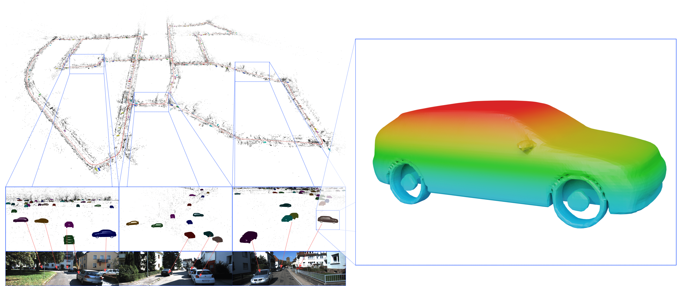

# DSP-SLAM

This repository contains code for DSP-SLAM, an object-oriented SLAM system that builds a rich and accurate joint map of dense 3D models for foreground objects, and sparse landmark points to represent the background. DSP-SLAM takes as input the 3D point cloud reconstructed by a feature-based SLAM system and equips it with the ability to enhance its sparse map with dense reconstructions of detected objects. Objects are detected via semantic instance segmentation, and their shape and pose are estimated using category-specific deep shape embeddings as priors, via a novel second order optimization.  Our object-aware bundle adjustment builds a pose-graph to jointly optimize camera poses, object locations and feature points. DSP-SLAM can operate at $10$ frames per second on 3 different input modalities: monocular, stereo, or stereo+LiDAR.

We demonstrate DSP-SLAM operating at almost frame rate on monocular-RGB sequences from the Friburg and Redwood-OS datasets, and on stereo+LiDAR sequences on the KITTI odometry dataset showing that it achieves high-quality full object reconstructions, even from partial observations, while maintaining a consistent global map. Our evaluation shows improvements in object pose and shape reconstruction with respect to recent deep prior-based reconstruction methods and reductions in camera tracking drift on the KITTI dataset.

This repository contains the stereo+LiDAR implementation of DSP-SLAM. More information and the paper can be found at our [project page](https://jingwenwang95.github.io/dsp-slam/).

## Publication

* [DSP-SLAM: Object Oriented SLAM with Deep Shape Priors](https://arxiv.org/abs/2108.09481), Jingwen Wang, [Martin Rünz](https://www.martinruenz.de/), [Lourdes Agapito](http://www0.cs.ucl.ac.uk/staff/L.Agapito/), 3DV '21

## Acknowledgements
Research presented here has been supported by the UCL Centre for Doctoral Training in Foundational AI under UKRI grant number EP/S021566/1. We thank [Wonbong Jang](https://sites.google.com/view/wbjang/home) and Adam Sherwood for fruitful discussions.
